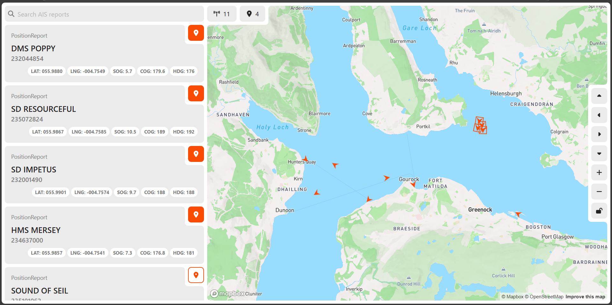
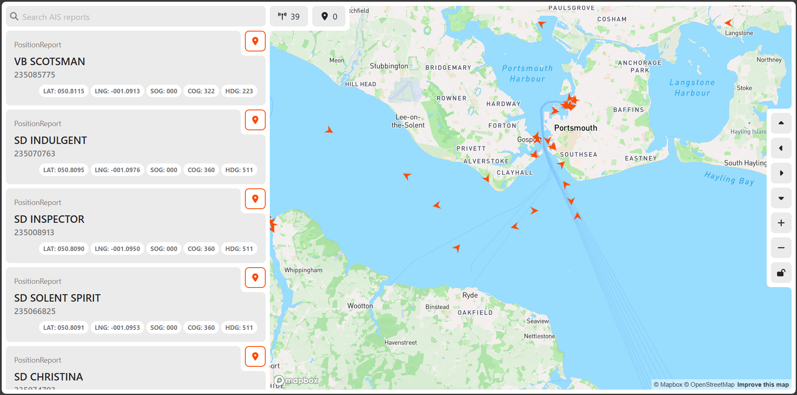

# AIS Tracker 🛳️

AIS Tracker is a web application that tracks real-time ship movements.


_AIS Tracker App - HMS Mersey departing Faslane_


_AIS Tracker App - Busy Portsmouth Harbour_

## Setup

**Note**: Setup requires a [Docker](https://docs.docker.com/get-started/introduction/get-docker-desktop/) installation and the setup of free third-party API keys from [aisstream.io](https://aisstream.io) and [mapbox](https://mapbox.com).

#### 1. Clone the repository

```bash
git clone https://github.com/richardIambert/ais-tracker.git
```

#### 2. Change into the project root directory

```bash
cd ais-tracker
```

#### 3. Create required third-party API keys

ais-tracker requires [aisstream.io](https://aisstream.io/apikeys) and [mapbox](https://console.mapbox.com/account/access-tokens) API keys. These keys are free to setup but require you to create accounts with these services.

#### 4. Setup required environment variables

Create a `.env` file in the project root directory and add the following:

```
# API environment variables
API_PORT=3000
AISSTREAM_API_KEY=<YOUR_AISSTREAM_API_KEY>
AISSTREAM_API_URL=wss://stream.aisstream.io/v0/stream
FORCE_COLOR=1
WAIT_TIME=1000

# Client environment variables
CLIENT_PORT=80
VITE_MAPBOX_API_KEY=<YOUR_MAPBOX_API_KEY>
VITE_MAPBOX_STYLE_URL=mapbox://styles/richardlambert/cm788w2sb00mr01qvesiycpqp
VITE_API_URL=ws://localhost:3000
```

#### 5. Run docker compose

From the project root directory, run:

```bash
docker compose up
```

#### 6. Open the app

When docker compose has finished setting up, open the app by navigating to [http://localhost:80](http://localhost:80) in a web browser.
